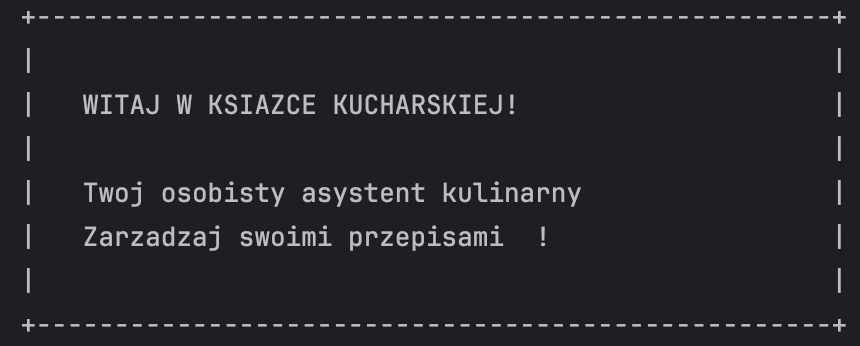
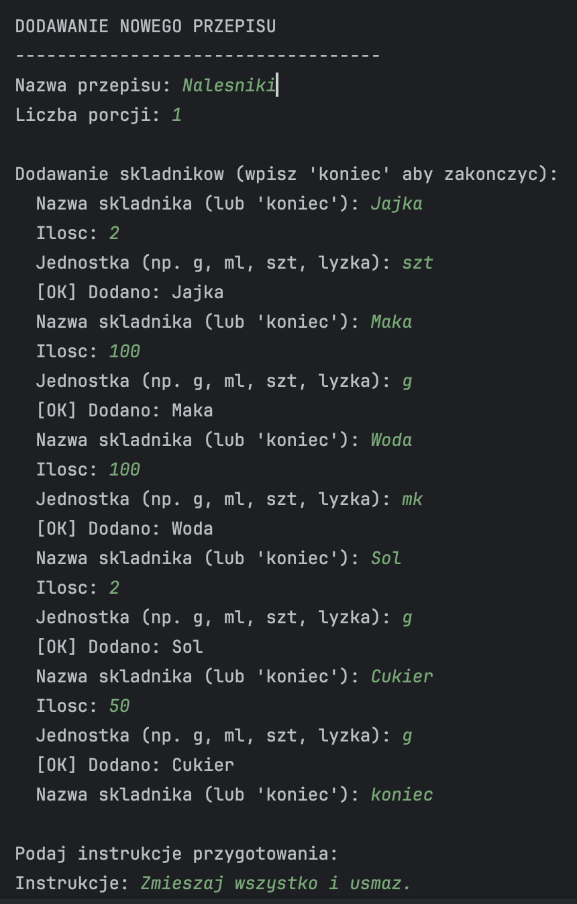
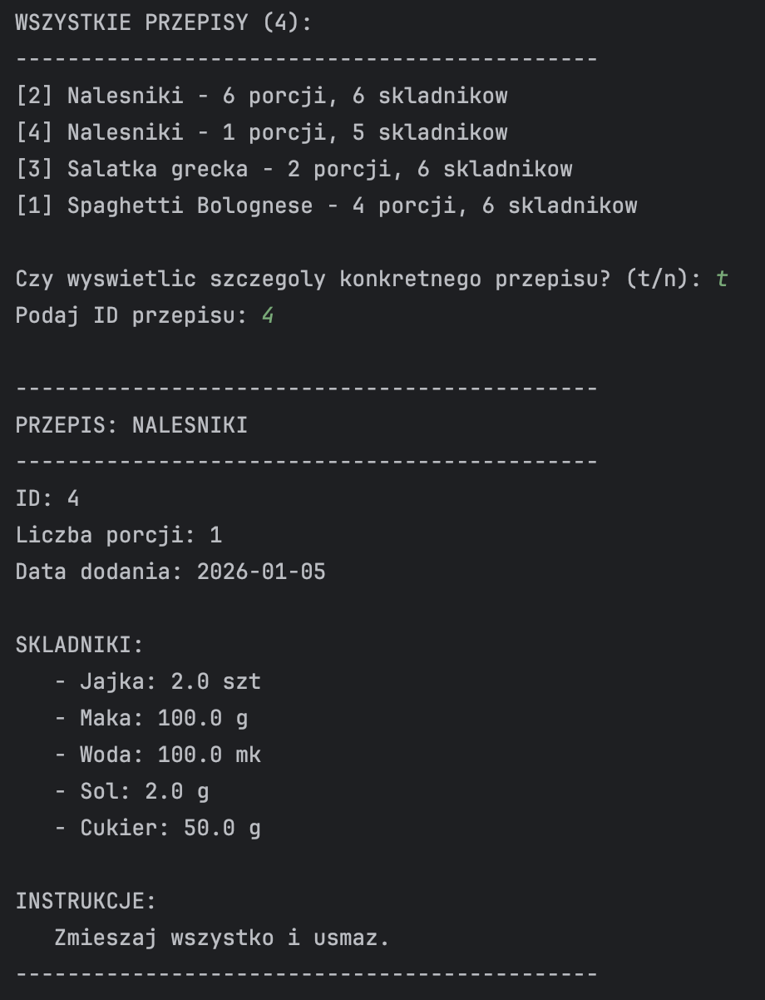
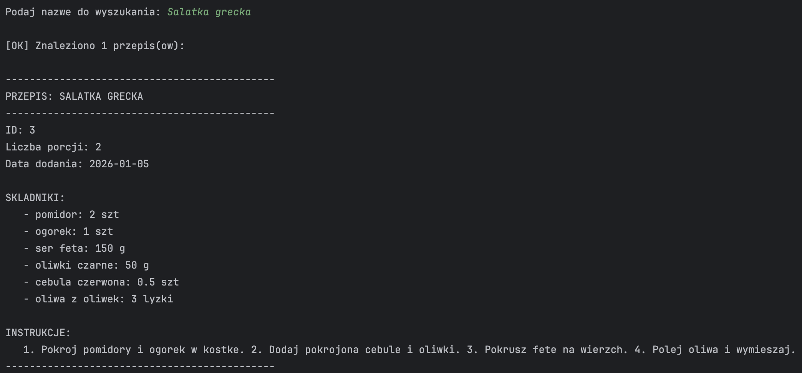
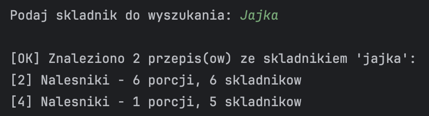
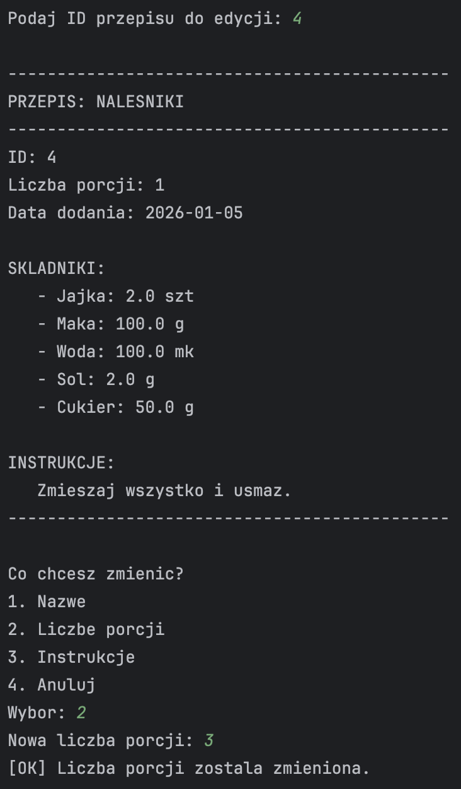
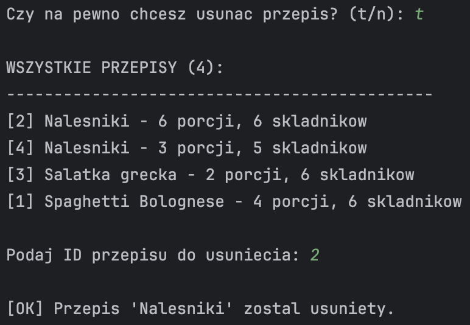
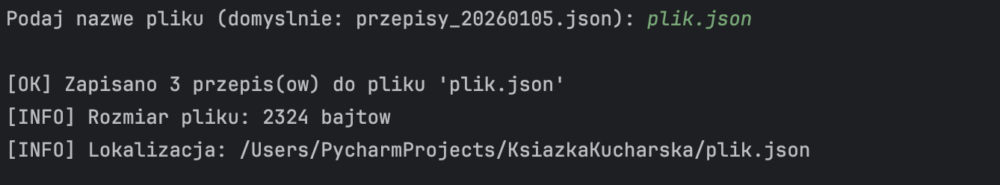

# Ksiazka Kucharska



## Autor

Oliwia Kołacz (indeks 83099) - Programowanie w językach skryptowych

## Opis projektu

Aplikacja konsolowa do zarzadzania przepisami kulinarnymi napisana w Pythonie. Pozwala na dodawanie, edycje, wyszukiwanie przepisow oraz zapis i odczyt z plikow.

## Spelnienie wymagan projektowych

Aplikacja zostala stworzona zgodnie z nastepujacymi wymaganiami:

### 1. Aplikacja pozwalajaca na pobieranie danych od uzytkownika i ich przetworzenie

- Funkcja `get_valid_input()` pobiera dane z walidacja typu i zakresu
- Interaktywne dodawanie przepisow (nazwa, skladniki, instrukcje)
- Wyszukiwanie na podstawie danych wprowadzonych przez uzytkownika

### 2. Aplikacja posiadajaca menu pozwalajace na wybor jednej z kilku opcji przetwarzania danych

- Menu glowne z 9 opcjami (0-8)
- Petla `while True` obslugujaca wybor uzytkownika
- Rozne operacje przetwarzania: dodawanie, wyszukiwanie, edycja, usuwanie

### 3. Aplikacja zawierajaca funkcje wbudowane, funkcje wlasne, listy lub slowniki

**Funkcje wbudowane:**
- `len()` - liczenie przepisow i skladnikow
- `sorted()` - sortowanie przepisow alfabetycznie
- `input()`, `print()` - interakcja z uzytkownikiem
- `isinstance()` - walidacja typow danych
- `str.lower()`, `str.strip()` - przetwarzanie tekstu

**Funkcje wlasne:**
- `add_recipe()` - dodawanie przepisu
- `search_by_name()` - wyszukiwanie po nazwie
- `search_by_ingredient()` - wyszukiwanie po skladniku
- `delete_recipe()` - usuwanie przepisu
- `edit_recipe()` - edycja przepisu
- `get_valid_input()` - walidacja danych wejsciowych
- `format_recipe_full()` - formatowanie wyswietlania
- `save_to_json()` - zapis do pliku
- `load_from_json()` - odczyt z pliku

**Listy:**
- `self.recipes` - lista wszystkich przepisow
- `ingredients` - lista skladnikow w kazdym przepisie
- `found` - lista wynikow wyszukiwania

**Slowniki:**
- Kazdy przepis jako slownik z kluczami: id, name, servings, ingredients, instructions, created_at
- Kazdy skladnik jako slownik z kluczami: name, amount, unit

### 4. Aplikacja skladajaca sie z kilku modulow wlasnych i modulow biblioteki standardowej

**Moduly wlasne:**

| Modul | Odpowiedzialnosc |
|-------|-----------------|
| `main.py` | Menu glowne, petla programu |
| `recipe_manager.py` | Operacje CRUD na przepisach |
| `file_handler.py` | Obsluga plikow JSON |
| `recipe_utils.py` | Funkcje pomocnicze |

**Moduly biblioteki standardowej:**

| Modul | Uzycie |
|-------|--------|
| `json` | Zapis i odczyt plikow JSON |
| `os` | Operacje na plikach (istnienie, rozmiar, listowanie) |
| `datetime` | Generowanie dat |
| `sys` | Wyjscie z programu |

### 5. Aplikacja posiadajaca mozliwosc zapisu danych do pliku lub odczytu danych za pomoca opcji wybranej z menu

- Opcja 7: Zapis przepisow do pliku JSON
- Opcja 8: Odczyt przepisow z pliku JSON
- Walidacja struktury danych przy imporcie
- Obsluga bledow zapisu/odczytu

## Wymagania systemowe

- Python 3.8 - 3.14+
- macOS / Linux / Windows

## Instalacja i uruchomienie

```bash
# Uruchom aplikacje
python3 main.py
```

## Menu aplikacji

```
+--------------------------------------+
|       KSIAZKA KUCHARSKA              |
+--------------------------------------+
|  1. Dodaj nowy przepis               |
|  2. Wyswietl wszystkie przepisy      |
|  3. Wyszukaj przepis po nazwie       |
|  4. Wyszukaj po skladniku            |
|  5. Edytuj przepis                   |
|  6. Usun przepis                     |
|  7. Zapisz do pliku                  |
|  8. Wczytaj z pliku                  |
|  0. Wyjscie                          |
+--------------------------------------+
```

## Struktura danych przepisu (JSON)

```json
{
  "id": 1,
  "name": "Spaghetti Bolognese",
  "servings": 4,
  "ingredients": [
    {"name": "makaron", "amount": 400, "unit": "g"},
    {"name": "mieso mielone", "amount": 500, "unit": "g"}
  ],
  "instructions": "1. Ugotuj makaron...",
  "created_at": "2026-01-05"
}
```

## Przyklad uzycia

### 1. Dodawanie nowego przepisu


### 2. Wyswietlanie wszystkich przepisow


### 3. Znajdowanie przepisu po nazwie


### 4. Znajdowanie przepisu po skladniku


### 5. Edytowanie przepisu


### 6. Usuwanie przepisu


### 7. Zapis do pliku


### 8. Odczyt z pliku

